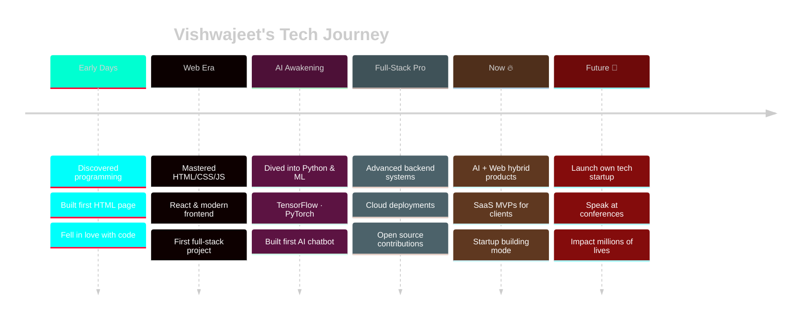

<div align="center">


</div>

<div align="center">


</div>

<br>

<div align="center">

<a href="https://github.com/codeby-Vishwajeet"></a>&nbsp;
<a href="https://github.com/codeby-Vishwajeet?tab=followers"></a>&nbsp;
<a href="https://linkedin.com/in/vishwajeet-ramniwas-3631a83a3"></a>&nbsp;
<a href="https://vishwajeet-ai-dev.netlify.app"></a>&nbsp;
<a href="mailto:srivrdeveloper@gmail.com"></a>

</div>

---


## `{ about_me }`

```typescript
const vishwajeet: Developer = {
  name        : "Vishwajeet Ramniwas",
  role        : "AI Developer & Full-Stack Engineer 🚀",
  location    : "India 🇮🇳  |  UTC +5:30",

  mission     : "Build impactful tech that changes lives 🌍",
  motto       : "Started early. Built daily. Dream globally. 💫",

  currentWork : [
    "🤖 AI-Powered SaaS Products",
    "🌐 Modern Full-Stack Applications",
    "⚡ Intelligent Automation Systems",
    "🚀 Startup MVP Development",
  ],

  superpower  : "Turning coffee into working code ☕ → 💻",

  contact: {
    email     : "srivrdeveloper@gmail.com",
    portfolio : "vishwajeet-ai-dev.netlify.app",
    linkedin  : "vishwajeet-ramniwas-3631a83a3",
  },
};
```

<br clear="right"/>

> *"Technology is not just about code — it's about creating  
> possibilities that didn't exist before."*

---

## `{ tech_arsenal }`

<div align="center">

### ◈ Frontend Engineering

[](https://reactjs.org)
[](https://nextjs.org)
[](https://typescriptlang.org)
[](https://developer.mozilla.org/en-US/docs/Web/JavaScript)
[](https://tailwindcss.com)
[](https://angular.io)
[](https://redux.js.org)
[](https://sass-lang.com)

### ◈ Backend Engineering

[](https://python.org)
[](https://fastapi.tiangolo.com)
[](https://djangoproject.com)
[](https://nodejs.org)
[](https://nestjs.com)
[](https://expressjs.com)
[](https://graphql.org)
[](https://flask.palletsprojects.com)

### ◈ AI · ML · Data Science

[](https://tensorflow.org)
[](https://pytorch.org)
[](https://opencv.org)
[](https://scikit-learn.org)


### ◈ Databases

[](https://postgresql.org)
[](https://mongodb.com)
[](https://mysql.com)
[](https://firebase.google.com)
[](https://redis.io)
[](https://sqlite.org)

### ◈ Cloud · DevOps · Infrastructure

[](https://aws.amazon.com)
[](https://cloud.google.com)
[](https://docker.com)
[](https://kubernetes.io)
[](https://vercel.com)
[](https://netlify.com)
[](https://github.com/features/actions)
[](https://linux.org)

### ◈ Tools & Workflow

[](https://git-scm.com)
[](https://code.visualstudio.com)
[](https://postman.com)
[](https://figma.com)
[](https://gnu.org/software/bash)

</div>

---

## `{ github_analytics }`

<div align="center">


</div>

---

## `{ trophies }`

<div align="center">


</div>

---

## `{ contribution_graph }`

<div align="center">

[](https://github.com/codeby-Vishwajeet)

</div>

---

## `{ what_i_build }`

<table>
<tr>
<td valign="top" width="50%">

### 🤖 AI & Machine Learning
```
▸ Intelligent Chatbots & Virtual Assistants
▸ Predictive Analytics & Data Models
▸ Natural Language Processing Apps
▸ Computer Vision Systems
▸ AI Automation & Workflow Tools
▸ Recommendation Engines (RAG, LLMs)
```

</td>
<td valign="top" width="50%">

### 🌐 Full-Stack Web
```
▸ Modern Responsive Web Applications
▸ Progressive Web Apps (PWAs)
▸ SaaS Product MVPs
▸ E-Commerce Platforms
▸ Real-Time Systems (WebSockets)
▸ Secure Auth & REST / GraphQL APIs
```

</td>
</tr>
<tr>
<td valign="top" width="50%">

### 🚀 Startup & Product
```
▸ Rapid MVP Development
▸ SaaS Architecture Design
▸ EdTech & FinTech Solutions
▸ Business Automation Platforms
▸ Product Strategy & Roadmapping
▸ Growth Hacking Experiments
```

</td>
<td valign="top" width="50%">

### 📚 Continuous Learning
```
▸ Advanced System Architecture
▸ Cloud Infrastructure & DevOps
▸ Cybersecurity Best Practices
▸ Data Structures & Algorithms
▸ Microservices & Distributed Systems
▸ LLM Fine-tuning & Prompt Engineering
```

</td>
</tr>
</table>

---

## `{ coding_activity }`

<div align="center">

<!--START_SECTION:waka-->
```text
Python         ████████████░░░░░░░░░   48.5%   ·  12 hrs 30 mins
JavaScript     ██████░░░░░░░░░░░░░░░   24.6%   ·  06 hrs 20 mins
React / TSX    ████░░░░░░░░░░░░░░░░░   16.2%   ·  04 hrs 10 mins
CSS / SCSS     ██░░░░░░░░░░░░░░░░░░░    8.1%   ·  02 hrs 05 mins
Other          █░░░░░░░░░░░░░░░░░░░░    2.6%   ·  00 hrs 40 mins
```
<!--END_SECTION:waka-->

</div>

---

## `{ journey }`



---

## `{ 2025_roadmap }`

<div align="center">

| Mission | Progress | ETA | Status |
|:--------|:--------:|:---:|:------:|
| 🚀 Build 10+ Full-Stack Projects | `████████░░` 80% | Q2 2025 | 🔥 |
| 🤖 Master Advanced AI Engineering | `███████░░░` 70% | Q3 2025 | 💪 |
| 🌍 20+ Open Source Contributions | `██████░░░░` 60% | Q3 2025 | 🌟 |
| 🎓 Complete 5+ Certifications | `████████░░` 80% | Q2 2025 | ✅ |
| ⭐ Reach 1000+ GitHub Followers | `█████░░░░░` 50% | Q3 2025 | 📊 |
| 📝 Write 50+ Technical Articles | `███░░░░░░░` 30% | Q4 2025 | 📈 |
| 🏢 Launch My Startup / SaaS | `██░░░░░░░░` 20% | Q4 2025 | 🎯 |
| 🎤 Speak at Tech Conferences | `░░░░░░░░░░` 0% | 2026 | 🎬 |

</div>

---

## `{ open_for }`

<div align="center">

<table>
<tr>
<td align="center" width="20%"><br><b>💼 Collaboration</b><br><sub>Always open</sub><br><br></td>
<td align="center" width="20%"><br><b>🏆 Hackathons</b><br><sub>Let's compete</sub><br><br></td>
<td align="center" width="20%"><br><b>💻 Freelance</b><br><sub>Available now</sub><br><br></td>
<td align="center" width="20%"><br><b>🚀 Startups</b><br><sub>Co-founding</sub><br><br></td>
<td align="center" width="20%"><br><b>🎓 Mentorship</b><br><sub>Happy to help</sub><br><br></td>
</tr>
</table>

</div>

---

## `{ connect }`

<div align="center">

> *"I love connecting with passionate people — say hi, I'll always reply!"* 👋

[](https://linkedin.com/in/vishwajeet-ramniwas-3631a83a3)
[](mailto:srivrdeveloper@gmail.com)
[](https://vishwajeet-ai-dev.netlify.app)
[](https://github.com/codeby-Vishwajeet)

[](https://twitter.com/vishwajeet_dev)
[](https://discord.gg/vishwajeet)
[](https://instagram.com/vishwajeet.codes)
[](https://youtube.com/@vishwajeetcodes)
[](https://medium.com/@vishwajeet)
[](https://stackoverflow.com/users/vishwajeet)

</div>

---

## `{ support }`

<div align="center">

**If my work saved you time, a coffee means the world! ☕**

[](https://buymeacoffee.com/CodeWithVishwajeet)
[](https://ko-fi.com/vishwajeetdev)
[](https://patreon.com/vishwajeetdev)
[](https://paypal.me/vishwajeetdev)

</div>

---

## `{ contribution_snake }`

<div align="center">

<picture>
  <source media="(prefers-color-scheme: dark)" srcset="https://raw.githubusercontent.com/codeby-Vishwajeet/codeby-Vishwajeet/output/github-contribution-grid-snake-dark.svg" />
  <source media="(prefers-color-scheme: light)" srcset="https://raw.githubusercontent.com/codeby-Vishwajeet/codeby-Vishwajeet/output/github-contribution-grid-snake.svg" />
  
</picture>

</div>

---

## `{ quote }`

<div align="center">


</div>

---

<div align="center">


<br>

[](https://github.com/codeby-Vishwajeet?tab=repositories)&nbsp;
[](https://github.com/codeby-Vishwajeet)

<br>

```
╔═══════════════════════════════════════════════════════╗
║  Made with passion ❤️  ·  Powered by coffee ☕         ║
║  © 2025 Vishwajeet Ramniwas  ·  India 🇮🇳              ║
║  "Building the future, one commit at a time." ⚡       ║
╚═══════════════════════════════════════════════════════╝
```

</div>
