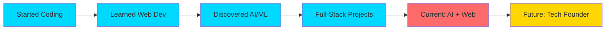

# 🌌 Welcome to My Digital Universe

<div align="center">
  
  

</div>

<div align="center">
  
</div>

<p align="center">
  
  
  
  
</p>

---

## 🎯 About Me


```typescript
const vishwajeet = {
    name: "Vishwajeet Ramniwas",
    role: "AI Developer & Full-Stack Engineer 🚀",
    location: "India 🇮🇳",
    age: "Young & Ambitious",
    
    mission: "Building impactful tech that changes lives 🌍",
    motto: "Started early. Building daily. Dreaming globally. 💫",
    
    workingOn: [
        "🤖 AI-Powered Applications",
        "🌐 Modern Full-Stack Projects",
        "🚀 Startup MVP Development",
        "⚡ Smart Automation Tools"
    ],
    
    learning: [
        "Advanced AI Engineering",
        "System Architecture & Design",
        "Cloud Infrastructure",
        "Startup Growth Strategies"
    ],
    
    contact: {
        email: "srivrdeveloper@gmail.com",
        portfolio: "vishwajeet-ai-dev.netlify.app"
    },
    
    funFact: "I started young, dream big, and build like there's no limit! ⚡"
};
```

<br clear="right"/>

<div align="center">
  
### 💡 My Philosophy

> *"Technology is not just about code — it's about creating possibilities that didn't exist before."*


</div>

---

## 🛠️ Technology Arsenal

<div align="center">

### 🎨 Frontend Development


### ⚙️ Backend Development


### 🗄️ Databases


### ☁️ Cloud & DevOps


### 🔧 Tools & Platforms


### 🤖 AI & Data Science


</div>

---

## 📊 GitHub Analytics Dashboard

<div align="center">
  
  
  
  
</div>

<div align="center">
  
  
  
  
</div>

<div align="center">
  
</div>

---

## 🏆 GitHub Trophies

<div align="center">
  
</div>

---

## 📈 Contribution Graph

<div align="center">
  
</div>

---

## 🎯 What I'm Building

<table width="100%">
<tr>
<td width="50%" valign="top">

<h3 align="center">🤖 AI & Machine Learning</h3>

<div align="center">
  
</div>

- 🧠 Intelligent Chatbots & Virtual Assistants
- 📊 Predictive Analytics & Data Models
- 🔍 Natural Language Processing Apps
- 🎯 Computer Vision Projects
- ⚡ Automation & Workflow Tools
- 🤝 AI-Powered Recommendation Systems

</td>
<td width="50%" valign="top">

<h3 align="center">🌐 Web Development</h3>

<div align="center">
  
</div>

- 💻 Modern Responsive Websites
- 🚀 Full-Stack Web Applications
- 📱 Progressive Web Apps (PWAs)
- 🛒 E-Commerce Platforms
- 🎨 Interactive UI/UX Designs
- 🔐 Secure Authentication Systems

</td>
</tr>
<tr>
<td width="50%" valign="top">

<h3 align="center">🚀 Startup & Innovation</h3>

<div align="center">
  
</div>

- 💡 MVP Development & Prototyping
- 📈 SaaS Application Building
- 🎓 EdTech Solutions
- 💼 Business Automation Tools
- 🌟 Product Design & Strategy
- 🔥 Growth Hacking Projects

</td>
<td width="50%" valign="top">

<h3 align="center">🎓 Continuous Learning</h3>

<div align="center">
  
</div>

- 🏗️ Advanced System Architecture
- ☁️ Cloud Infrastructure & DevOps
- 🔒 Cybersecurity Best Practices
- 📊 Data Structures & Algorithms
- 🧪 Test-Driven Development
- 🌐 Microservices Architecture

</td>
</tr>
</table>

---

## 🐍 Contribution Snake Animation

<div align="center">
  <picture>
    <source media="(prefers-color-scheme: dark)" srcset="https://raw.githubusercontent.com/platane/snk/output/github-contribution-grid-snake-dark.svg">
    <source media="(prefers-color-scheme: light)" srcset="https://raw.githubusercontent.com/platane/snk/output/github-contribution-grid-snake.svg">
    
  </picture>
</div>

---

## 🌟 Featured Projects

<div align="center">

<table>
<tr>
<td width="50%">

<h3 align="center">🤖 AI Projects</h3>

<div align="center">  
<a href="https://github.com/codeby-Vishwajeet">

</a>
</div>

<p align="center">
<a href="https://github.com/codeby-Vishwajeet" target="_blank">

</a>
</p>

</td>

<td width="50%">

<h3 align="center">🌐 Web Projects</h3>

<div align="center">  
<a href="https://github.com/codeby-Vishwajeet">

</a>
</div>

<p align="center">
<a href="https://github.com/codeby-Vishwajeet" target="_blank">

</a>
</p>

</td>
</tr>
</table>

</div>

---

## 💻 Coding Activity & Stats

<div align="center">

### 📊 Weekly Development Breakdown

<!--START_SECTION:waka-->
```text
Python       12 hrs 30 mins  ████████████░░░░░░░░  48.5%
JavaScript   6 hrs 20 mins   ██████░░░░░░░░░░░░░░  24.6%
React        4 hrs 10 mins   ████░░░░░░░░░░░░░░░░  16.2%
CSS          2 hrs 5 mins    ██░░░░░░░░░░░░░░░░░░   8.1%
Others       40 mins         █░░░░░░░░░░░░░░░░░░░   2.6%
```
<!--END_SECTION:waka-->

</div>

<div align="center">
  
### 📅 Contribution Heat Map


</div>

---

## 🔝 Top Contributed Repositories

<div align="center">
  
</div>

---

## 🤝 Let's Connect & Collaborate

<div align="center">

 <em><b>I love connecting with different people</b> so if you want to say <b>hi, I'll be happy to meet you more!</b> 😊</em>

<br><br>

[](https://linkedin.com/in/vishwajeet-ramniwas-3631a83a3)
[](mailto:srivrdeveloper@gmail.com)
[](https://vishwajeet-ai-dev.netlify.app)
[](https://github.com/codeby-Vishwajeet)

[](https://twitter.com/vishwajeet_dev)
[](https://discord.gg/vishwajeet)
[](https://instagram.com/vishwajeet.codes)
[](https://youtube.com/@vishwajeetcodes)
[](https://stackoverflow.com/users/vishwajeet)
[](https://medium.com/@vishwajeet)

</div>

---

## 🎯 I'm Open For

<div align="center">

<table>
<tr>
<td align="center" width="20%">
<br>
<b>💼 Collaboration</b>
</td>
<td align="center" width="20%">
<br>
<b>🏆 Hackathons</b>
</td>
<td align="center" width="20%">
<br>
<b>💻 Freelance</b>
</td>
<td align="center" width="20%">
<br>
<b>🚀 Startups</b>
</td>
<td align="center" width="20%">
<br>
<b>🎓 Mentorship</b>
</td>
</tr>
</table>

</div>

---

## ☕ Support My Journey

<div align="center">


### 💖 If you find my work valuable, consider supporting me!

[](https://buymeacoffee.com/CodeWithVishwajeet)
[](https://paypal.me/vishwajeetdev)
[](https://ko-fi.com/vishwajeetdev)
[](https://patreon.com/vishwajeetdev)

</div>

---

## 🎓 Certifications & Achievements

<div align="center">

<table>
<tr>
<td align="center" width="25%">
<br>
<b>🤖 AI & ML</b><br>
<sub>2024</sub>
</td>
<td align="center" width="25%">
<br>
<b>🌐 Full-Stack</b><br>
<sub>2024</sub>
</td>
<td align="center" width="25%">
<br>
<b>☁️ Cloud Computing</b><br>
<sub>2024</sub>
</td>
<td align="center" width="25%">
<br>
<b>🔐 Cybersecurity</b><br>
<sub>2023</sub>
</td>
</tr>
</table>

</div>

---

## 🌟 Fun Facts About Me

<div align="center">


```javascript
const funFacts = {
    codingStyle: "Clean, Documented, and Scalable 🎨",
    favoriteEditor: "VS Code with 50+ Extensions 💻",
    coffeeConsumed: "☕☕☕☕☕ (Per Day)",
    debuggingMethod: "console.log() everywhere 🔍",
    musicWhileCoding: "Lo-fi Beats & Synthwave 🎵",
    dreamProject: "Building AI that helps humanity 🌍",
    superpower: "Turning coffee into code ⚡",
    workingHours: "When inspiration strikes! 🌙",
    favoriteLanguage: "Python 🐍",
    currentlyReading: "Clean Code by Robert C. Martin 📚"
};
```

</div>

<br clear="right"/>

---

## 🎯 2024 Goals & Progress

<div align="center">

| Goal | Progress | Status |
|:---|:---:|:---:|
| 🚀 Build 10+ Full-Stack Projects | ████████░░ 80% | 🔥 |
| 🤖 Master Advanced AI Techniques | ███████░░░ 70% | 💪 |
| 📝 Write 50+ Technical Blog Posts | ███░░░░░░░ 30% | 📈 |
| 🏆 Contribute to 20+ Open Source | ██████░░░░ 60% | 🌟 |
| 🎓 Complete 5+ Certifications | ████████░░ 80% | ✅ |
| 💼 Launch My Own Startup | ██░░░░░░░░ 20% | 🎯 |
| 🌟 Reach 1000+ GitHub Followers | █████░░░░░ 50% | 📊 |
| 🎤 Speak at 2+ Tech Conferences | ░░░░░░░░░░ 0% | 🎬 |

</div>

---

## 📚 Latest Blog Posts & Articles

<div align="center">


<!-- BLOG-POST-LIST:START -->
- 🤖 **How to Build Your First AI Chatbot** - Coming Soon!
- 🌐 **Modern Web Development Best Practices** - Coming Soon!
- 🚀 **From Idea to MVP: A Startup Guide** - Coming Soon!
- ⚡ **Python Tips for Productivity** - Coming Soon!
<!-- BLOG-POST-LIST:END -->

</div>

---

## 🎵 Currently Listening To

<div align="center">
  


</div>

---

## 💡 Random Dev Wisdom

<div align="center">


</div>

---

## 🎨 GitHub Metrics

<div align="center">
  


</div>

---

## 🏅 GitHub Achievements

<div align="center">


</div>

---

## 🔥 Streak Stats

<div align="center">
  


</div>

---

## 🌐 My Tech Journey

<div align="center">



</div>

---

<div align="center">
  
## 🌈 Let's Build Something Amazing Together!


### ⭐ Don't Forget to Star My Repositories!

[](https://github.com/codeby-Vishwajeet?tab=repositories)
[](https://github.com/codeby-Vishwajeet)

<br>


<br>
 **💙 Made with Passion, Coffee ☕, and Countless Lines of Code 💻** 
*© 2024 Vishwajeet Ramniwas • Building the Future, One Commit at a Time* ⚡

<br>


</div>

---

<div align="center">
  
### 🎉 Thank You for Visiting! Come Back Soon! 🎉


</div>
