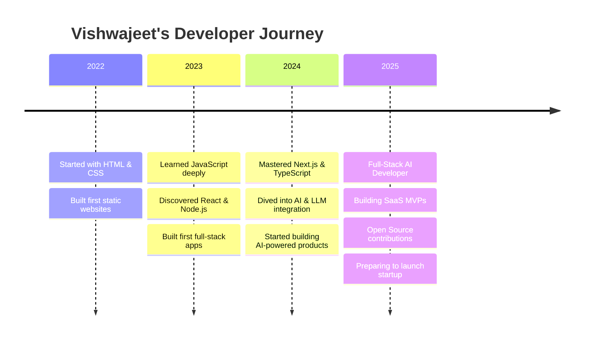

<div align="center">


</div>

<div align="center">


</div>

<div align="center">

[](https://github.com/codeby-Vishwajeet)
[](https://github.com/codeby-Vishwajeet)
[](https://github.com/codeby-Vishwajeet)

</div>

---

## 👨‍💻 Who Am I?

```typescript
const vishwajeet = {
  name: "Vishwajeet Ramniwas",
  alias: "codeby-Vishwajeet",
  role: ["AI Developer", "Full-Stack Engineer", "Future Founder"],
  location: "India 🇮🇳",
  email: "srivrdeveloper@gmail.com",
  portfolio: "https://vishwajeet-ai-dev.netlify.app",

  currentFocus: [
    "Building AI-powered web applications",
    "Mastering backend architecture & system design",
    "Contributing to open-source projects",
    "Launching startup MVPs",
  ],

  lifePhilosophy: "Started early. Building daily. Dreaming globally. 🚀",

  funFact: "I debug code at 2AM and call it 'peak productivity' 😄",
  openToWork: true,
  availableFor: ["Freelance", "Collaboration", "Internships", "Open Source"],
};
```

---

## 🎯 Current Status

<div align="center">

| 🔭 Currently Working On | 🌱 Currently Learning | 👯 Looking to Collaborate On | 💬 Ask Me About |
|:---|:---|:---|:---|
| AI-Powered Web Apps | Advanced AI Engineering | Open Source Projects | React & Next.js |
| Startup MVPs | Cloud & DevOps (AWS/GCP) | SaaS Products | Python & FastAPI |
| Automation Systems | System Design | AI/ML Projects | Full-Stack Dev |
| Full-Stack Platforms | LLM Integration | Startup Ideas | AI Applications |

</div>

---

## 🛠️ Tech Stack & Tools

### 🎨 Frontend
<div align="center">


</div>

### ⚙️ Backend
<div align="center">


</div>

### 🗄️ Databases
<div align="center">


</div>

### 🤖 AI / ML
<div align="center">


</div>

### ☁️ Cloud & DevOps
<div align="center">


</div>

### 🧰 Tools & Others
<div align="center">


</div>

---

## 📊 GitHub Statistics

<div align="center">


</div>

<div align="center">


</div>

---

## 📈 Contribution Activity

<div align="center">


</div>

---

## 🏆 GitHub Trophies

<div align="center">


</div>

---

## 🚀 Featured Projects

<div align="center">

### 🤖 AI Projects

| Project | Description | Tech Stack | Status |
|:---|:---|:---|:---|
| **AI Chat Platform** | Full-stack LLM-powered chat app with memory & multi-model support | Next.js, LangChain, OpenAI, MongoDB | 🟢 Active |
| **AI Resume Analyzer** | Upload resume → get AI-powered feedback, ATS score & improvements | React, FastAPI, Python, OpenAI | 🟢 Active |
| **Code Review Bot** | GitHub bot that auto-reviews PRs using AI with detailed suggestions | Node.js, GitHub API, OpenAI | 🔨 Building |
| **AI Content Generator** | Generate blog posts, social content & SEO copy with one click | Next.js, GPT-4, Tailwind, Firebase | 🟢 Active |

### 🌐 Full-Stack Projects

| Project | Description | Tech Stack | Status |
|:---|:---|:---|:---|
| **SaaS Starter Kit** | Production-ready SaaS boilerplate with auth, billing & dashboard | Next.js, Stripe, Prisma, PostgreSQL | 🟢 Active |
| **Dev Portfolio Builder** | Drag-and-drop portfolio builder for developers | React, Node.js, MongoDB, AWS S3 | 🔨 Building |
| **Task Automation Hub** | No-code automation platform inspired by Zapier | Next.js, FastAPI, Redis, Docker | 📋 Planned |
| **E-Commerce Platform** | Modern storefront with payment integration & admin panel | Next.js, Stripe, MongoDB, Tailwind | 🟢 Active |

</div>

<div align="center">

<a href="https://github.com/codeby-Vishwajeet?tab=repositories">

</a>

</div>

---

## 🎯 2025 Goals & Progress

<div align="center">

| 🎯 Goal | 📊 Progress | 🏁 Target |
|:---|:---|:---|
| 🤖 Ship 5 AI Projects | `████████░░` 80% | Dec 2025 |
| 🌐 Full-Stack Mastery | `███████░░░` 70% | Dec 2025 |
| ☁️ AWS Certification | `█████░░░░░` 50% | Sep 2025 |
| 💻 100 Open Source PRs | `██████░░░░` 60% | Dec 2025 |
| 🚀 Launch 1 SaaS MVP | `████░░░░░░` 40% | Oct 2025 |
| 📝 Write 50 Tech Articles | `███░░░░░░░` 30% | Dec 2025 |
| ⭐ 500 GitHub Stars | `██████░░░░` 60% | Dec 2025 |

</div>

---

## 🧠 Skills & Expertise

<div align="center">

```
Frontend Development    ████████████████████░  95%
React / Next.js         ███████████████████░░  90%
Node.js / Express       ██████████████████░░░  85%
Python / FastAPI        █████████████████░░░░  80%
AI / LLM Integration    ████████████████░░░░░  75%
Database Design         █████████████████░░░░  80%
Docker / DevOps         ██████████████░░░░░░░  65%
System Design           █████████████░░░░░░░░  60%
Cloud (AWS/GCP)         ████████████░░░░░░░░░  55%
UI/UX Design            ███████████████░░░░░░  70%
```

</div>

---

## 📚 Currently Learning

<div align="center">

<table>
<tr>
<td align="center" width="200">

<br/>Fine-tuning, RAG, Agents
</td>
<td align="center" width="200">

<br/>Scalable architectures
</td>
<td align="center" width="200">

<br/>Cloud architect path
</td>
</tr>
<tr>
<td align="center" width="200">

<br/>Container orchestration
</td>
<td align="center" width="200">

<br/>Systems programming
</td>
<td align="center" width="200">

<br/>From dev to founder
</td>
</tr>
</table>

</div>

---

## 💼 Experience & Journey



---

## 🌟 Open Source Contributions

<div align="center">

[](https://holopin.io/@codeby-Vishwajeet)

</div>

I actively contribute to open source and believe in the power of community-driven development. Here's what I focus on:

- 🐛 **Bug Fixes** — Finding and squashing bugs in popular libraries
- 📝 **Documentation** — Improving docs for better developer experience  
- ✨ **Features** — Adding new capabilities to tools I use daily
- 🔍 **Code Reviews** — Helping maintainers review incoming PRs
- 🌱 **Mentoring** — Helping beginners make their first contributions

---

## 📝 Latest Blog Posts

<!-- BLOG-POST-LIST:START -->
- 🚀 [How I Built an AI-Powered Web App from Scratch in 7 Days](https://vishwajeet-ai-dev.netlify.app/blog)
- 🤖 [Understanding LangChain: A Practical Guide for Developers](https://vishwajeet-ai-dev.netlify.app/blog)
- ⚡ [Next.js 14 App Router: Everything You Need to Know](https://vishwajeet-ai-dev.netlify.app/blog)
- 🐍 [FastAPI vs Express: Which Backend Should You Choose in 2025?](https://vishwajeet-ai-dev.netlify.app/blog)
- 🎯 [System Design for Junior Developers: Where to Start](https://vishwajeet-ai-dev.netlify.app/blog)
<!-- BLOG-POST-LIST:END -->

<div align="center">

<a href="https://vishwajeet-ai-dev.netlify.app/blog">

</a>

</div>

---

## 🎮 Coding Activity (WakaTime)

<div align="center">


</div>

> 💡 *I spend most of my time in VS Code, building full-stack & AI projects. My most used languages are TypeScript, Python, and JavaScript.*

---

## 📊 Weekly Development Breakdown

```text
TypeScript     ██████████████░░░░░░░   55.2%
Python         ██████████░░░░░░░░░░░   38.4%
CSS/Tailwind   ███░░░░░░░░░░░░░░░░░░   10.8%
Markdown       ██░░░░░░░░░░░░░░░░░░░    8.1%
JSON/YAML      █░░░░░░░░░░░░░░░░░░░░    4.3%
Shell          █░░░░░░░░░░░░░░░░░░░░    3.2%
```

---

## 🌍 Visitor Map & Stats

<div align="center">


</div>

<div align="center">

| 📅 Coding Since | 🌍 Location | ⏰ Timezone | 🌐 Languages |
|:---:|:---:|:---:|:---:|
| 2022 | India 🇮🇳 | IST (UTC+5:30) | English, Hindi |

</div>

---

## 🤝 Let's Connect & Collaborate

<div align="center">

### I'm always open to exciting opportunities!

<a href="https://github.com/codeby-Vishwajeet">

</a>
<a href="mailto:srivrdeveloper@gmail.com">

</a>
<a href="https://linkedin.com/in/vishwajeet-ramniwas">

</a>
<a href="https://twitter.com/vishwajeet_dev">

</a>
<a href="https://vishwajeet-ai-dev.netlify.app">

</a>
<a href="https://dev.to/codeby-vishwajeet">

</a>
<a href="https://hashnode.com/@vishwajeet-dev">

</a>

</div>

---

## 💬 Testimonials & Feedback

> *"Vishwajeet has an exceptional ability to turn complex AI concepts into working products quickly. His code is clean and his problem-solving approach is impressive."*
> — **Collaborator on AI Project**

> *"One of the most dedicated developers I've worked with. He ships fast and learns even faster."*
> — **Open Source Maintainer**

> *"Vishwajeet's full-stack skills combined with AI knowledge makes him stand out from most developers his age."*
> — **Mentor & Senior Developer**

---

## 🐍 Contribution Snake

<div align="center">

<picture>
  <source media="(prefers-color-scheme: dark)" srcset="https://raw.githubusercontent.com/codeby-Vishwajeet/codeby-Vishwajeet/output/github-contribution-grid-snake-dark.svg"/>
  <source media="(prefers-color-scheme: light)" srcset="https://raw.githubusercontent.com/codeby-Vishwajeet/codeby-Vishwajeet/output/github-contribution-grid-snake.svg"/>
  
</picture>

</div>

---

## 🎲 Fun Facts About Me

<div align="center">

```
🌙  I'm most productive between 10PM - 2AM (night owl coder)
☕  I run on coffee + curiosity
🎯  I set weekly goals every Sunday
📖  I read at least one tech article every day
🎮  I play chess to sharpen problem-solving skills
🌱  I open-source everything I can
🤝  I believe in "learn in public"
🚀  I shipped my first AI app in just 3 days
```

</div>

---

## 💡 Dev Quote of the Day

<div align="center">


</div>

<div align="center">

### *"The best time to start was yesterday. The next best time is NOW."* 🚀

---

### ⚡ *Started early. Building daily. Dreaming globally.*

</div>

---

<div align="center">


</div>

<div align="center">

**Made with ❤️ by Vishwajeet Ramniwas**

*If you like my work, consider giving a ⭐ to my repos!*

</div>
