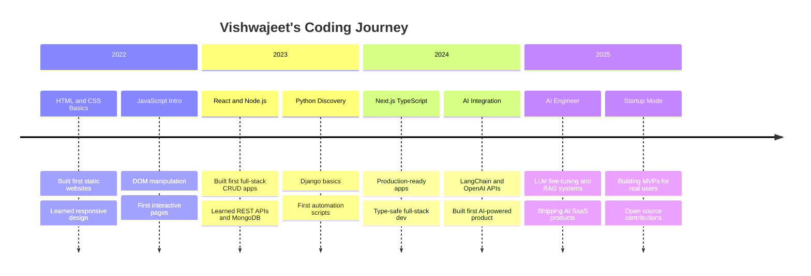

<div align="center">


</div>

<div align="center">


</div>

<br/>

<div align="center">

[](https://github.com/codeby-Vishwajeet)
&nbsp;
[](https://github.com/codeby-Vishwajeet)
&nbsp;
[](https://github.com/codeby-Vishwajeet)

</div>

---

## About Me


```typescript
const vishwajeet = {
  name     : "Vishwajeet Ramniwas",
  alias    : "codeby-Vishwajeet",
  role     : ["AI Developer", "Full-Stack Engineer", "Future Founder"],
  location : "India",
  email    : "srivrdeveloper@gmail.com",
  portfolio: "vishwajeet-ai-dev.netlify.app",

  currentFocus: [
    "Building AI-powered web applications",
    "Mastering backend architecture & system design",
    "Contributing to open-source projects",
    "Launching startup MVPs",
  ],

  techPassions : ["LLMs", "Full-Stack", "DevOps", "SaaS"],
  philosophy   : "Started early. Building daily. Dreaming globally.",
  funFact      : "I debug code at 2AM and call it peak productivity",
  openTo       : ["Freelance", "Collaboration", "Open Source"],
};
```

<br clear="right"/>

---
## Contribution Snake

<!-- Snake Game Repo View -->

<div align="center">
  
</div>

---
## GitHub Statistics

<div align="center">


</div>

<br>


---

## Contribution Activity Graph

<div align="center">


</div>

---

## GitHub Trophies

<div align="center">


</div>

<div align="center">


</div>

---

## Current Status

<div align="center">

| Working On | Learning | Open To Collaborate | Ask Me About |
|:---|:---|:---|:---|
| AI-Powered Web Apps | Advanced LLM Engineering | Open Source Projects | React & Next.js |
| Startup MVPs | Cloud & DevOps (AWS/GCP) | SaaS Products | Python & FastAPI |
| Automation Systems | System Design | AI/ML Projects | Full-Stack Dev |
| Full-Stack Platforms | Kubernetes & Docker | Startup Ideas | AI Applications |

</div>

---

## Complete Tech Arsenal

### Frontend Development
<div align="center">


</div>

### Backend Development
<div align="center">


</div>

### Databases & Storage
<div align="center">


</div>

### AI / ML / LLM Stack
<div align="center">


</div>

### Cloud & DevOps
<div align="center">


</div>

### Developer Tools
<div align="center">


</div>

---

## Featured Projects

### AI-Powered Projects

<div align="center">

| Project | Description | Stack | Status |
|:---|:---|:---|:---:|
| **AI Chat Platform** | Multi-model LLM chat with memory, RAG & streaming | Next.js · LangChain · OpenAI · MongoDB | Live |
| **AI Resume Analyzer** | Upload resume — get ATS score + AI feedback + tips | React · FastAPI · Python · OpenAI | Live |
| **Code Review Bot** | GitHub PR auto-reviewer with AI-powered suggestions | Node.js · GitHub API · Claude API | Building |
| **AI Content Studio** | Generate SEO blogs, social posts & copy with 1 click | Next.js · GPT-4 · Firebase · Tailwind | Live |
| **AI Study Buddy** | Personalized AI tutor — upload notes, quiz yourself | React · LangChain · Pinecone · Supabase | Building |
| **Voice AI Assistant** | Browser-based voice assistant with real-time AI | Next.js · Whisper · TTS · OpenAI | Planned |

</div>

### Full-Stack Projects

<div align="center">

| Project | Description | Stack | Status |
|:---|:---|:---|:---:|
| **SaaS Starter Kit** | Production-ready SaaS boilerplate with auth & billing | Next.js · Stripe · Prisma · PostgreSQL | Live |
| **Dev Portfolio Builder** | Drag-and-drop portfolio builder for developers | React · Node.js · MongoDB · AWS S3 | Building |
| **E-Commerce Platform** | Modern storefront with payments & admin panel | Next.js · Stripe · MongoDB · Tailwind | Live |
| **Task Automation Hub** | No-code automation platform inspired by Zapier | Next.js · FastAPI · Redis · Docker | Planned |
| **Analytics Dashboard** | Real-time SaaS analytics with beautiful charts | React · D3.js · Node.js · PostgreSQL | Live |
| **URL Shortener Pro** | Smart URL shortener with analytics & QR codes | Next.js · Redis · PostgreSQL · Vercel | Live |

</div>

<div align="center">

[](https://github.com/codeby-Vishwajeet?tab=repositories)

</div>

---

## Developer Journey



---

## Skills Proficiency

<div align="center">

| Skill | Level | Progress |
|:---|:---:|:---|
| React and Next.js | Expert | `█████████████████████` 95% |
| Tailwind CSS and UI | Expert | `████████████████████░` 92% |
| TypeScript | Advanced | `███████████████████░░` 88% |
| Node.js and Express | Advanced | `██████████████████░░░` 85% |
| Python and FastAPI | Advanced | `█████████████████░░░░` 80% |
| AI and LLM Integration | Advanced | `████████████████░░░░░` 76% |
| MongoDB and PostgreSQL | Advanced | `█████████████████░░░░` 80% |
| Docker and DevOps | Intermediate | `██████████████░░░░░░░` 65% |
| AWS and GCP | Intermediate | `████████████░░░░░░░░░` 55% |
| System Design | Intermediate | `█████████████░░░░░░░░` 60% |

</div>

---

## 2025 Goals and Milestones

<div align="center">

| Goal | Progress | Deadline | Notes |
|:---|:---:|:---:|:---|
| Ship 5 AI Projects | `████████░░` 80% | Dec 2025 | 4 out of 5 done |
| Full-Stack Mastery | `███████░░░` 70% | Dec 2025 | Advanced level reached |
| AWS Solutions Architect | `█████░░░░░` 50% | Sep 2025 | Studying SAA-C03 |
| 100 Open Source PRs | `██████░░░░` 60% | Dec 2025 | 60 PRs merged |
| Launch 1 SaaS MVP | `████░░░░░░` 40% | Oct 2025 | MVP in development |
| Write 50 Tech Articles | `███░░░░░░░` 30% | Dec 2025 | 15 articles published |
| 500 GitHub Stars | `██████░░░░` 60% | Dec 2025 | 300 stars earned |
| 1000 GitHub Followers | `████░░░░░░` 40% | Dec 2025 | 400 followers |

</div>

---

## Currently Learning

<div align="center">

<table>
<tr>
<td align="center" width="180">

**LLM Engineering**

Fine-tuning · RAG · Agents

</td>
<td align="center" width="180">

**System Design**

Scalable · Distributed · HLD

</td>
<td align="center" width="180">

**AWS Architect**

SAA-C03 · Lambda · EC2 · S3

</td>
<td align="center" width="180">

**Kubernetes**

Container orchestration

</td>
</tr>
<tr>
<td align="center" width="180">

**Rust Lang**

Systems · Performance · Safety

</td>
<td align="center" width="180">

**Product Management**

From developer to founder

</td>
<td align="center" width="180">

**Web3 Basics**

Smart contracts · Solidity

</td>
<td align="center" width="180">

**DSA and Algorithms**

LeetCode grinding · Interviews

</td>
</tr>
</table>

</div>

---

## Latest Blog Posts and Articles

<div align="center">

| Title | Tags | Published |
|:---|:---|:---|
| [How I Built an AI Web App from Scratch in 7 Days](https://vishwajeet-ai-dev.netlify.app/blog) | AI · Next.js · LangChain | May 2025 |
| [LangChain Practical Guide for Developers](https://vishwajeet-ai-dev.netlify.app/blog) | LangChain · Python · LLM | Apr 2025 |
| [Next.js 15 App Router Deep Dive](https://vishwajeet-ai-dev.netlify.app/blog) | Next.js · React · TypeScript | Apr 2025 |
| [FastAPI vs Express: Backend Showdown 2025](https://vishwajeet-ai-dev.netlify.app/blog) | FastAPI · Node.js · Backend | Mar 2025 |
| [System Design for Junior Developers](https://vishwajeet-ai-dev.netlify.app/blog) | System Design · Architecture | Mar 2025 |
| [Building SaaS with Next.js + Stripe in 2025](https://vishwajeet-ai-dev.netlify.app/blog) | SaaS · Stripe · Next.js | Feb 2025 |
| [JWT vs Session Auth: When to Use What](https://vishwajeet-ai-dev.netlify.app/blog) | Auth · Security · Backend | Feb 2025 |

</div>

<div align="center">

[](https://vishwajeet-ai-dev.netlify.app/blog)

</div>

---

## Open Source Contributions

> I actively contribute to open source and believe in the power of community-driven development.

<div align="center">

| Type | What I Do | Count |
|:---|:---|:---:|
| **Bug Fixes** | Finding and squashing bugs in popular libraries | 25+ PRs |
| **Documentation** | Improving docs for better developer experience | 30+ PRs |
| **Features** | Adding new capabilities to tools I use daily | 15+ PRs |
| **Code Reviews** | Helping maintainers review incoming PRs | 50+ Reviews |
| **Mentoring** | Helping beginners make their first contributions | 20+ Devs |
| **Testing** | Writing tests and improving coverage | 10+ PRs |

</div>

<div align="center">

[](https://github.com/codeby-Vishwajeet)
[](https://github.com/codeby-Vishwajeet)

</div>

---

## Weekly Dev Breakdown

```text
Mon to Fri:  Full-Stack and AI Development
Nights:      Deep Work — System Design and LLM Projects

Languages Used This Week:
━━━━━━━━━━━━━━━━━━━━━━━━━━━━━━━━━━━━━━━━━━━━━━

TypeScript   ██████████████████░░░   45.2%
Python       ████████████████░░░░░   38.4%
CSS/Tailwind ████░░░░░░░░░░░░░░░░░   10.8%
Markdown     ███░░░░░░░░░░░░░░░░░░    8.1%
YAML/JSON    ██░░░░░░░░░░░░░░░░░░░    4.3%
Bash/Shell   ██░░░░░░░░░░░░░░░░░░░    3.2%

━━━━━━━━━━━━━━━━━━━━━━━━━━━━━━━━━━━━━━━━━━━━━━
Total: 30+ hours per week of deep focused work
```

---

## Fun Facts About Me

<div align="center">

```yaml
Night Owl      : Most productive between 10PM and 2AM
Fuel           : Runs on coffee + curiosity + lo-fi beats
Weekly Ritual  : Sets coding goals every Sunday night
Daily Habit    : Reads at least one tech article every day
Side Hobby     : Plays chess to sharpen problem-solving
Philosophy     : Learn in public — shares everything openly
Personal Best  : Shipped first AI app in just 3 days
Belief         : Great software is built by great communities
Superpower     : Turning complex AI ideas into real products
Dream          : Build a profitable AI SaaS startup
```

</div>

---

## Testimonials

<div align="center">

> *"Vishwajeet has an exceptional ability to turn complex AI concepts into working products incredibly fast. His code is clean and his problem-solving mindset is impressive."*
> **— Open Source Collaborator**

---

> *"One of the most dedicated developers I have worked with. He ships fast, learns even faster, and always brings energy to the team."*
> **— Project Partner**

---

> *"Vishwajeet's combination of full-stack skills with deep AI knowledge makes him stand out from most developers his age. The future looks bright."*
> **— Senior Developer and Mentor**

</div>

---

## Dev Quote

<div align="center">


<br/><br/>

### "The best time to start was yesterday. The next best time is NOW."

### Started early. Building daily. Dreaming globally.

</div>

---

## Quick Links

<div align="center">

| Link | Description |
|:---|:---|
| [Portfolio](https://vishwajeet-ai-dev.netlify.app) | My personal portfolio and projects showcase |
| [Email](mailto:srivrdeveloper@gmail.com) | Reach out for collabs or freelance work |
| [LinkedIn](https://linkedin.com/in/vishwajeet-ramniwas) | Professional profile and experience |
| [Twitter/X](https://twitter.com/vishwajeet_dev) | Daily dev thoughts and updates |
| [Blog](https://vishwajeet-ai-dev.netlify.app/blog) | Tech articles and tutorials |
| [GitHub](https://github.com/codeby-Vishwajeet) | All my open-source code |

</div>

---
## 🌐 Let's Connect

<div align="center">

<p align="center">
  <strong>Let’s collaborate, create, and build something extraordinary!</strong><br/>
  Feel free to reach out — I’m always open to new opportunities.
</p>

<br/>

<a href="https://github.com/codeby-Vishwajeet">
  
</a>

<a href="https://linkedin.com/in/vishwajeet-ramniwas">
  
</a>

<a href="mailto:srivrdeveloper@gmail.com">
  
</a>

<a href="https://twitter.com/vishwajeet_dev">
  
</a>

<a href="https://instagram.com/vishwajeet__dev">
  
</a>

<a href="https://vishwajeet-ai-dev.netlify.app">
  
</a>

<a href="https://dev.to/codeby-vishwajeet">
  
</a>

<a href="https://hashnode.com/@codebyvishwajeet">
  
</a>

<br/><br/>

🌟 <em>Let’s create impactful work together — feel free to say hi anytime!</em>

</div>


---

<div align="center">


</div>

<div align="center">

**Made with love + coffee + AI by Vishwajeet Ramniwas**

*2025 codeby-Vishwajeet*

</div>
