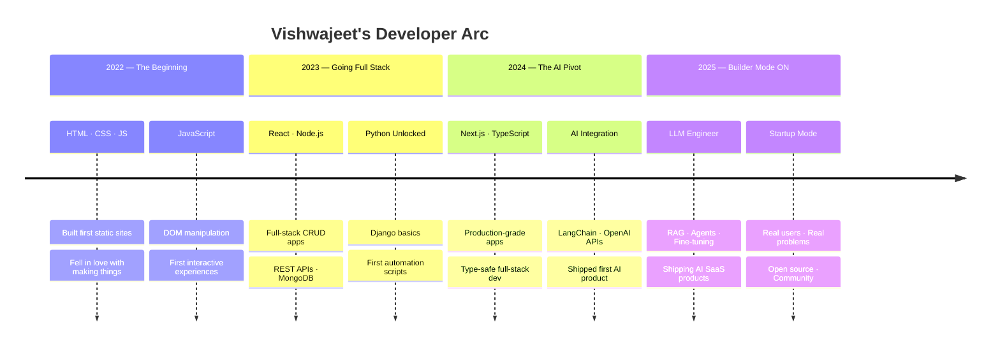

<div align="center">

<!-- ═══════════════════════════════════════════════════════ -->
<!--                  ANIMATED HEADER BANNER                -->
<!-- ═══════════════════════════════════════════════════════ -->


</div>

<br/>

<div align="center">


</div>

<br/>

<div align="center">

[](https://github.com/codeby-Vishwajeet)
&nbsp;
[](https://github.com/codeby-Vishwajeet)
&nbsp;
[](https://github.com/codeby-Vishwajeet)
&nbsp;
[](https://vishwajeet-ai-dev.netlify.app)

</div>

<br/>

---

<br/>

<!-- ═══════════════════════════════════════════════════════ -->
<!--                      WHO AM I                         -->
<!-- ═══════════════════════════════════════════════════════ -->

## `$ whoami`


```typescript
const vishwajeet: Developer = {
  name     : "Vishwajeet Ramniwas",
  alias    : "codeby-Vishwajeet",
  role     : ["AI Developer", "Full-Stack Engineer", "Future Founder"],
  location : "🇮🇳 India",
  email    : "srivrdeveloper@gmail.com",
  portfolio: "vishwajeet-ai-dev.netlify.app",

  building : [
    "AI-powered SaaS products",
    "LLM pipelines with RAG & Agents",
    "Scalable full-stack platforms",
    "Open source tools devs actually use",
  ],

  superpower : "Turning complex AI ideas into shipped products",
  funFact    : "I debug at 2AM and call it 'peak performance mode'",
  openTo     : ["Freelance", "Collaboration", "Open Source", "Startup Builds"],
  philosophy : "Started early. Building daily. Dreaming globally.",
};
```

<br clear="right"/>

<br/>

---

<br/>

<!-- ═══════════════════════════════════════════════════════ -->
<!--                    WHAT I DO                          -->
<!-- ═══════════════════════════════════════════════════════ -->

## `$ cat current_status.log`

<div align="center">

|  | Focus Area | Status |
|:---:|:---|:---:|
| 🤖 | Building AI-powered web apps & LLM pipelines | 🟢 Active |
| 🧪 | Shipping SaaS MVPs with real users | 🟢 Active |
| ☁️ | Cracking AWS Solutions Architect (SAA-C03) | 🟡 In Progress |
| 🌐 | Open source contributions & community | 🟢 Active |
| 📝 | Writing deep-dive tech articles | 🟡 In Progress |
| 🦀 | Learning Rust & advanced system design | 🟡 In Progress |

</div>

<br/>

---

<br/>

<!-- ═══════════════════════════════════════════════════════ -->
<!--                   TECH STACK                          -->
<!-- ═══════════════════════════════════════════════════════ -->

## `$ ls -la tech_stack/`

### 🖥️ Frontend

<div align="center">


</div>

### ⚙️ Backend

<div align="center">


</div>

### 🗄️ Databases & Storage

<div align="center">


</div>

### 🤖 AI / ML / LLM

<div align="center">


</div>

### ☁️ Cloud & DevOps

<div align="center">


</div>

<br/>

---

<br/>

<!-- ═══════════════════════════════════════════════════════ -->
<!--                 FEATURED PROJECTS                     -->
<!-- ═══════════════════════════════════════════════════════ -->

## `$ git log --oneline --all --projects`

### 🤖 AI-Powered Builds

<div align="center">

| 🚀 Project | 💡 What It Does | 🛠️ Stack | 📌 |
|:---|:---|:---|:---:|
| **AI Chat Platform** | Multi-model LLM chat — memory, RAG & streaming built-in | Next.js · LangChain · OpenAI · MongoDB | ✅ Live |
| **AI Resume Analyzer** | Upload PDF → get ATS score + AI feedback instantly | React · FastAPI · Python · OpenAI | ✅ Live |
| **AI Content Studio** | One-click SEO blogs, social posts & ad copy | Next.js · GPT-4 · Firebase · Tailwind | ✅ Live |
| **Analytics Dashboard** | Real-time SaaS metrics with beautiful D3 charts | React · D3.js · Node.js · PostgreSQL | ✅ Live |
| **Code Review Bot** | GitHub PR auto-reviewer — AI-powered suggestions | Node.js · GitHub API · Claude API | 🔨 Building |
| **AI Study Buddy** | Upload notes, quiz yourself with a personalized AI tutor | React · LangChain · Pinecone · Supabase | 🔨 Building |

</div>

### 🧱 Full-Stack Platforms

<div align="center">

| 🚀 Project | 💡 What It Does | 🛠️ Stack | 📌 |
|:---|:---|:---|:---:|
| **SaaS Starter Kit** | Production-ready boilerplate — auth, billing, dashboard | Next.js · Stripe · Prisma · PostgreSQL | ✅ Live |
| **E-Commerce Platform** | Modern storefront with payments & admin panel | Next.js · Stripe · MongoDB · Tailwind | ✅ Live |
| **URL Shortener Pro** | Smart links with analytics, QR codes & custom domains | Next.js · Redis · PostgreSQL · Vercel | ✅ Live |
| **Dev Portfolio Builder** | Drag-and-drop portfolio builder for developers | React · Node.js · MongoDB · AWS S3 | 🔨 Building |
| **Task Automation Hub** | No-code workflow automation — a Zapier alternative | Next.js · FastAPI · Redis · Docker | 📋 Planned |
| **Voice AI Assistant** | Browser-based voice AI with real-time streaming | Next.js · Whisper · TTS · OpenAI | 📋 Planned |

</div>

<div align="center">

[](https://github.com/codeby-Vishwajeet?tab=repositories)

</div>

<br/>

---

<br/>

<!-- ═══════════════════════════════════════════════════════ -->
<!--                 CODING JOURNEY                        -->
<!-- ═══════════════════════════════════════════════════════ -->

## `$ git log --author="Vishwajeet" --journey`



<br/>

---

<br/>

<!-- ═══════════════════════════════════════════════════════ -->
<!--                   GITHUB STATS                       -->
<!-- ═══════════════════════════════════════════════════════ -->

## `$ gh api stats --user=codeby-Vishwajeet`

<div align="center">


</div>

<div align="center">


</div>

<div align="center">


</div>

<br/>

---

<br/>

<!-- ═══════════════════════════════════════════════════════ -->
<!--                  CONTRIBUTION SNAKE                  -->
<!-- ═══════════════════════════════════════════════════════ -->

## `$ watch --snake contributions`

<div align="center">


</div>

<br/>

---

<br/>

<!-- ═══════════════════════════════════════════════════════ -->
<!--                    TROPHIES                          -->
<!-- ═══════════════════════════════════════════════════════ -->

## `$ gh trophy --all`

<div align="center">


</div>

<br/>

---

<br/>

<!-- ═══════════════════════════════════════════════════════ -->
<!--                 WEEKLY BREAKDOWN                     -->
<!-- ═══════════════════════════════════════════════════════ -->

## `$ top --dev-stats --week`

```text
 ⚡ WEEKLY DEVELOPMENT BREAKDOWN ──────────────────────────────────────────────

 Schedule:
 ├── Mon–Fri  ›  Full-Stack + AI Development (feature work, shipping)
 ├── Evenings ›  Deep Work — System Design, LLM Research
 └── Weekends ›  Open Source + Personal Projects

 Languages This Week:
 ─────────────────────────────────────────────────────────────────────────────
 TypeScript   ██████████████████░░░░   45.2 %   (frontend + backend logic)
 Python       ████████████████░░░░░░   38.4 %   (AI/ML pipelines, FastAPI)
 CSS/Tailwind ████░░░░░░░░░░░░░░░░░░   10.8 %   (UI polishing)
 Markdown     ███░░░░░░░░░░░░░░░░░░░    8.1 %   (docs, articles, READMEs)
 YAML/JSON    ██░░░░░░░░░░░░░░░░░░░░    4.3 %   (config, CI/CD pipelines)
 Bash/Shell   ██░░░░░░░░░░░░░░░░░░░░    3.2 %   (automation, deployment)
 ─────────────────────────────────────────────────────────────────────────────
 Total Output › 30+ hours / week of focused, intentional work
```

<br/>

---

<br/>

<!-- ═══════════════════════════════════════════════════════ -->
<!--                  2025 GOALS                          -->
<!-- ═══════════════════════════════════════════════════════ -->

## `$ cat goals_2025.json`

<div align="center">

| 🎯 Goal | 📊 Progress | ⏰ Deadline | 📝 Notes |
|:---|:---:|:---:|:---|
| Ship 5 AI Projects | `████████░░` 80% | Dec 2025 | 4 / 5 shipped ✅ |
| Full-Stack Mastery | `███████░░░` 70% | Dec 2025 | Advanced level hit |
| AWS Solutions Architect | `█████░░░░░` 50% | Sep 2025 | SAA-C03 in progress |
| 100 Open Source PRs | `██████░░░░` 60% | Dec 2025 | 60 PRs merged |
| Launch SaaS MVP | `████░░░░░░` 40% | Oct 2025 | MVP in development |
| Write 50 Tech Articles | `███░░░░░░░` 30% | Dec 2025 | 15 published |
| 500 GitHub Stars | `██████░░░░` 60% | Dec 2025 | 300 earned |
| 1000 GitHub Followers | `████░░░░░░` 40% | Dec 2025 | 400 followers |

</div>

<br/>

---

<br/>

<!-- ═══════════════════════════════════════════════════════ -->
<!--              OPEN SOURCE CONTRIBUTIONS               -->
<!-- ═══════════════════════════════════════════════════════ -->

## `$ git shortlog -s --open-source`

> Building in public. Contributing to open source. Helping others ship.

<div align="center">

| Contribution Type | What I Do | Volume |
|:---|:---|:---:|
| 🐛 Bug Fixes | Squashing bugs in widely-used libraries | 25+ PRs |
| 📚 Documentation | Making docs clearer for every developer | 30+ PRs |
| ✨ Features | Adding real capabilities to tools I use daily | 15+ PRs |
| 👁️ Code Reviews | Supporting maintainers with quality reviews | 50+ Reviews |
| 🤝 Mentoring | Helping beginners land their first merged PR | 20+ Devs |
| 🧪 Testing | Writing tests, improving coverage | 10+ PRs |

</div>

<div align="center">

[](https://github.com/codeby-Vishwajeet)
[](https://github.com/codeby-Vishwajeet)

</div>

<br/>

---

<br/>

<!-- ═══════════════════════════════════════════════════════ -->
<!--                 LATEST ARTICLES                      -->
<!-- ═══════════════════════════════════════════════════════ -->

## `$ rss --feed=blog --latest`

<div align="center">

| 📄 Article | 🏷️ Tags | 📅 Published |
|:---|:---|:---|
| [How I Built an AI Web App from Scratch in 7 Days](https://vishwajeet-ai-dev.netlify.app/blog) | `AI` `Next.js` `LangChain` | May 2025 |
| [LangChain Practical Guide for Developers](https://vishwajeet-ai-dev.netlify.app/blog) | `LangChain` `Python` `LLM` | Apr 2025 |
| [Next.js 15 App Router — Deep Dive](https://vishwajeet-ai-dev.netlify.app/blog) | `Next.js` `React` `TypeScript` | Apr 2025 |
| [FastAPI vs Express: Backend Showdown 2025](https://vishwajeet-ai-dev.netlify.app/blog) | `FastAPI` `Node.js` `Backend` | Mar 2025 |
| [System Design for Junior Developers](https://vishwajeet-ai-dev.netlify.app/blog) | `Architecture` `System Design` | Mar 2025 |
| [Building SaaS with Next.js + Stripe in 2025](https://vishwajeet-ai-dev.netlify.app/blog) | `SaaS` `Stripe` `Next.js` | Feb 2025 |
| [JWT vs Session Auth — When to Use What](https://vishwajeet-ai-dev.netlify.app/blog) | `Auth` `Security` `Backend` | Feb 2025 |

</div>

<div align="center">

[](https://vishwajeet-ai-dev.netlify.app/blog)

</div>

<br/>

---

<br/>

<!-- ═══════════════════════════════════════════════════════ -->
<!--                 FUN FACTS / TERMINAL                 -->
<!-- ═══════════════════════════════════════════════════════ -->

## `$ cat /etc/vishwajeet/config.yaml`

```yaml
# ── SYSTEM CONFIGURATION ────────────────────────────────────────────────────

identity:
  night_owl      : true                   # Most alive between 10PM–2AM
  daily_fuel     : ["coffee", "curiosity", "lo-fi beats"]
  weekly_ritual  : "Sets goals every Sunday. Ships by Friday."
  daily_habit    : "Reads at least one technical deep-dive every day"

stats:
  personal_best  : "Shipped first AI app in 3 days flat"
  side_hobby     : "Chess — because debugging is just problem-solving in disguise"
  superpower     : "Turning vague AI ideas into working products"
  dream          : "Build a profitable AI SaaS — bootstrapped, profitable, global"

philosophy:
  belief_1       : "Great software is built by great communities"
  belief_2       : "Learn in public. Share everything. Help others ship."
  belief_3       : "Started early. Building daily. Dreaming globally."
  north_star     : "Build things that matter. Ship things that last."

# ────────────────────────────────────────────────────────────────────────────
```

<br/>

---

<br/>

<!-- ═══════════════════════════════════════════════════════ -->
<!--                    WHAT OTHERS SAY                   -->
<!-- ═══════════════════════════════════════════════════════ -->

## `$ reviews --from=collaborators`

<div align="center">

<table>
<tr>
<td width="50%" valign="top">

> *"Vishwajeet has an exceptional ability to turn complex AI concepts into working products fast. His code is clean, his problem-solving mindset is sharp, and he ships when others are still planning."*

**— Open Source Collaborator**

</td>
<td width="50%" valign="top">

> *"One of the most dedicated developers I've worked with. He ships fast, learns even faster, and always brings energy to the team. A rare combination."*

**— Project Partner**

</td>
</tr>
<tr>
<td width="50%" valign="top">

> *"His combination of full-stack depth and AI knowledge makes him stand out from most developers his age. The future looks very bright for this one."*

**— Senior Developer & Mentor**

</td>
<td width="50%" valign="top">

> *"Asked a question in his issue tracker at 11PM. Had a working PR response by midnight. That level of responsiveness is rare and valuable in open source."*

**— OSS Maintainer**

</td>
</tr>
</table>

</div>

<br/>

---

<br/>

<!-- ═══════════════════════════════════════════════════════ -->
<!--                   CONNECT                            -->
<!-- ═══════════════════════════════════════════════════════ -->

## `$ curl https://connect.vishwajeet.dev`

<div align="center">

<p><strong>Building in public. Always open to collaborating, freelancing, or just talking tech.</strong><br/>
Drop a ⭐ on something you like. Send a message if you want to build something together.</p>

<br/>

<a href="https://github.com/codeby-Vishwajeet">
  
</a>
&nbsp;
<a href="https://linkedin.com/in/vishwajeet-ramniwas">
  
</a>
&nbsp;
<a href="mailto:srivrdeveloper@gmail.com">
  
</a>
&nbsp;
<a href="https://twitter.com/vishwajeet_dev">
  
</a>
&nbsp;
<a href="https://instagram.com/vishwajeet__dev">
  
</a>
&nbsp;
<a href="https://vishwajeet-ai-dev.netlify.app">
  
</a>
&nbsp;
<a href="https://dev.to/codeby-vishwajeet">
  
</a>
&nbsp;
<a href="https://hashnode.com/@codebyvishwajeet">
  
</a>

</div>

<br/>

---

<br/>

<div align="center">


<br/><br/>

### `> "Started early. Building daily. Dreaming globally."` `█`

</div>

<br/>

---

<div align="center">


</div>

<div align="center">

**Built with code + coffee + intention by Vishwajeet Ramniwas** &nbsp;·&nbsp; *© 2025 codeby-Vishwajeet*

</div>
