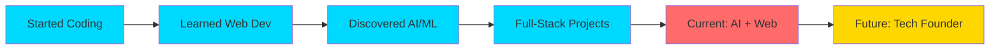

<div align="center">


</div>

<div align="center">


</div>

<p align="center">
  
  
  
  
</p>

---

## 🎯 About Me


```typescript
const vishwajeet = {
    name: "Vishwajeet Ramniwas",
    role: "AI Developer & Full-Stack Engineer 🚀",
    location: "India 🇮🇳",
    age: "Young & Ambitious",

    mission: "Building impactful tech that changes lives 🌍",
    motto: "Started early. Building daily. Dreaming globally. 💫",

    workingOn: [
        "🤖 AI-Powered Applications",
        "🌐 Modern Full-Stack Projects",
        "🚀 Startup MVP Development",
        "⚡ Smart Automation Tools"
    ],

    learning: [
        "Advanced AI Engineering",
        "System Architecture & Design",
        "Cloud Infrastructure",
        "Startup Growth Strategies"
    ],

    contact: {
        email: "srivrdeveloper@gmail.com",
        portfolio: "vishwajeet-ai-dev.netlify.app"
    },

    funFact: "I started young, dream big, and build like there's no limit! ⚡"
};
```

<br clear="right"/>

> *"Technology is not just about code — it's about creating possibilities that didn't exist before."*

---

## 🛠️ Technology Arsenal

<div align="center">

### 🎨 Frontend Development


### ⚙️ Backend Development


### 🗄️ Databases


### ☁️ Cloud & DevOps


### 🔧 Tools & Platforms


### 🤖 AI & Data Science


</div>

---

## 📊 GitHub Analytics

<div align="center">


</div>

<div align="center">


</div>

---

## 🎯 What I'm Building

<table width="100%">
<tr>
<td width="50%" valign="top">

### 🤖 AI & Machine Learning
- 🧠 Intelligent Chatbots & Virtual Assistants
- 📊 Predictive Analytics & Data Models
- 🔍 Natural Language Processing Apps
- 🎯 Computer Vision Projects
- ⚡ Automation & Workflow Tools
- 🤝 AI-Powered Recommendation Systems

</td>
<td width="50%" valign="top">

### 🌐 Web Development
- 💻 Modern Responsive Websites
- 🚀 Full-Stack Web Applications
- 📱 Progressive Web Apps (PWAs)
- 🛒 E-Commerce Platforms
- 🎨 Interactive UI/UX Designs
- 🔐 Secure Authentication Systems

</td>
</tr>
<tr>
<td width="50%" valign="top">

### 🚀 Startup & Innovation
- 💡 MVP Development & Prototyping
- 📈 SaaS Application Building
- 🎓 EdTech Solutions
- 💼 Business Automation Tools
- 🌟 Product Design & Strategy
- 🔥 Growth Hacking Projects

</td>
<td width="50%" valign="top">

### 🎓 Continuous Learning
- 🏗️ Advanced System Architecture
- ☁️ Cloud Infrastructure & DevOps
- 🔒 Cybersecurity Best Practices
- 📊 Data Structures & Algorithms
- 🧪 Test-Driven Development
- 🌐 Microservices Architecture

</td>
</tr>
</table>

---

## 💻 Weekly Development Breakdown

<div align="center">

<!--START_SECTION:waka-->
```text
Python       12 hrs 30 mins  ████████████░░░░░░░░  48.5%
JavaScript   6 hrs 20 mins   ██████░░░░░░░░░░░░░░  24.6%
React        4 hrs 10 mins   ████░░░░░░░░░░░░░░░░  16.2%
CSS          2 hrs 5 mins    ██░░░░░░░░░░░░░░░░░░   8.1%
Others       40 mins         █░░░░░░░░░░░░░░░░░░░   2.6%
```
<!--END_SECTION:waka-->

</div>

---

## 🌐 My Tech Journey

<div align="center">



</div>

---

## 🎯 2025 Goals & Progress

<div align="center">

| Goal | Progress | Status |
|:---|:---:|:---:|
| 🚀 Build 10+ Full-Stack Projects | ████████░░ 80% | 🔥 |
| 🤖 Master Advanced AI Techniques | ███████░░░ 70% | 💪 |
| 📝 Write 50+ Technical Blog Posts | ███░░░░░░░ 30% | 📈 |
| 🏆 Contribute to 20+ Open Source | ██████░░░░ 60% | 🌟 |
| 🎓 Complete 5+ Certifications | ████████░░ 80% | ✅ |
| 💼 Launch My Own Startup | ██░░░░░░░░ 20% | 🎯 |
| 🌟 Reach 1000+ GitHub Followers | █████░░░░░ 50% | 📊 |
| 🎤 Speak at 2+ Tech Conferences | ░░░░░░░░░░ 0% | 🎬 |

</div>

---

## 🎯 I'm Open For

<div align="center">

| 💼 Collaboration | 🏆 Hackathons | 💻 Freelance | 🚀 Startups | 🎓 Mentorship |
|:---:|:---:|:---:|:---:|:---:|
| Always open | Let's compete | Available now | Co-founding | Happy to help |

</div>

---

## 🤝 Let's Connect

<div align="center">

[](https://linkedin.com/in/vishwajeet-ramniwas-3631a83a3)
[](mailto:srivrdeveloper@gmail.com)
[](https://vishwajeet-ai-dev.netlify.app)
[](https://github.com/codeby-Vishwajeet)

[](https://twitter.com/vishwajeet_dev)
[](https://discord.gg/vishwajeet)
[](https://instagram.com/vishwajeet.codes)
[](https://youtube.com/@vishwajeetcodes)
[](https://stackoverflow.com/users/vishwajeet)
[](https://medium.com/@vishwajeet)

</div>

---

## ☕ Support My Journey

<div align="center">

**💖 If you find my work valuable, consider supporting me!**

[](https://buymeacoffee.com/CodeWithVishwajeet)
[](https://paypal.me/vishwajeetdev)
[](https://ko-fi.com/vishwajeetdev)

</div>

---

<div align="center">


### ⭐ Don't Forget to Star My Repositories!

[](https://github.com/codeby-Vishwajeet?tab=repositories)
[](https://github.com/codeby-Vishwajeet)

<br>

**💙 Made with Passion, Coffee ☕, and Countless Lines of Code 💻**

*© 2025 Vishwajeet Ramniwas • Building the Future, One Commit at a Time* ⚡

</div>
